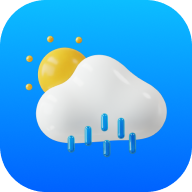
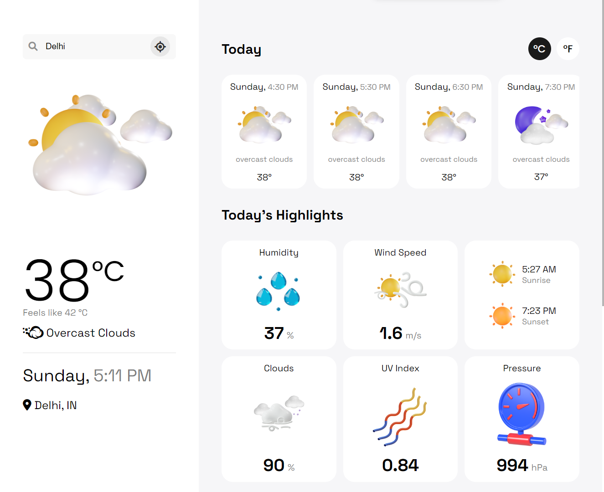

# **Weather App**

<div align="center">
    <b><a href="https://hweather.netlify.app" target="_blank">
     <br />
    Watch Demo
    </a></b>
</div>

## Installation

```
$ npm install
```

## App Configuration

Get Your OpenWeatherMap API KEY here: https://home.openweathermap.org/api_keys

Replace API Key with yours **[OPEN_WEATHER_MAP_API_KEY](https://github.com/hicodersofficial/weather-app/blob/main/src/config/config.js)**

## Preview



## **Thank You! ❣️**
